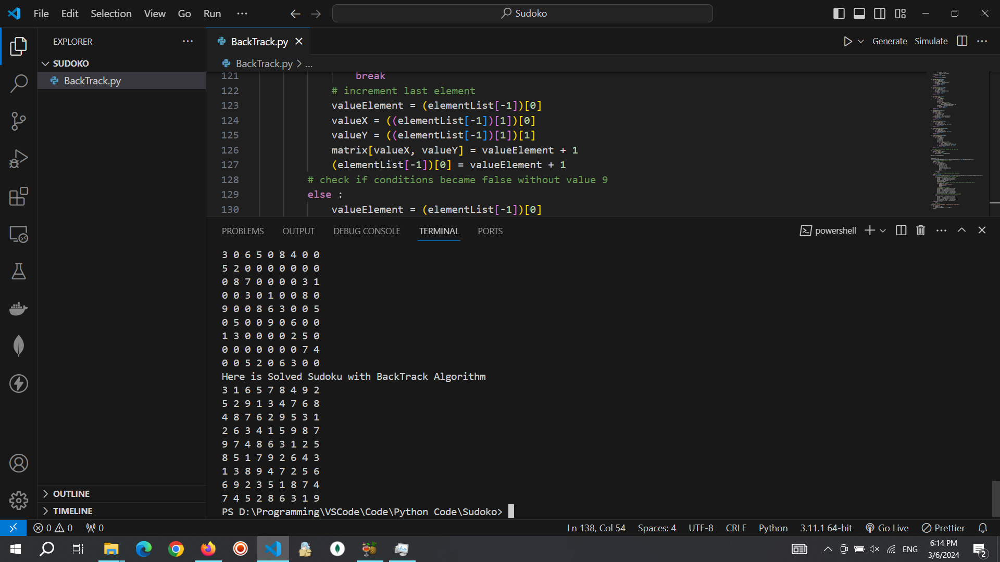

# Sudoku-Solver
Solving every Sudoku with BackTrack Algorithm.

## Tech :hammer_and_wrench: Languages and Tools :

<div>
  &nbsp;
  &nbsp;
</div>

## About sudoku

sudoku is a CSP problem puzzle that with limiting the possibilities (in sudoku we say that candidates) and place the one possible candidate on the each cell to complete all empty cells.
a valid sudoku should have each 1 to 9 number in each row, column and 3 * 3 Square.

## About BackTrack

BackTrack is a one of the brute force methods works like a searching in tree with DFP (Depth-first search) heuristic. also Backtrack generates all possible states and we can reach the answer with confidence.
also Backtrack is algorithm used in AI. we can optimize the backtrack algorithm with proning the branchs and we call that intellijence backtrack!

## How to use

```python
python BackTrack.py
```

you can use this as input:
```python
3 0 6 5 0 8 4 0 0
5 2 0 0 0 0 0 0 0
0 8 7 0 0 0 0 3 1
0 0 3 0 1 0 0 8 0
9 0 0 8 6 3 0 0 5
0 5 0 0 9 0 6 0 0
1 3 0 0 0 0 2 5 0
0 0 0 0 0 0 0 7 4
0 0 5 2 0 6 3 0 0
```

## Example



## Features

- Solves any valid 9×9 Sudoku puzzle
- Uses backtracking
- Handles invalid Sudoku inputs

## Tutorial Video

https://youtu.be/VpZHaJULavM

[](https://youtu.be/VpZHaJULavM)

## Tutorial

this code read 9 * 9 sudoku that each 0 indicates the empty cells in sudoku and we want to fill all empty cells (all zeroes) with 1 to 9 numbers if the sudoku is wrong one code will say that this sudoku is wrong one (like duplicated values in rows or columns)  

